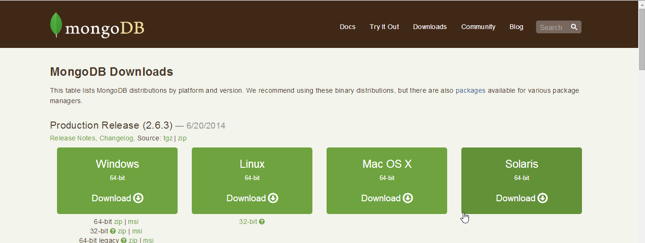
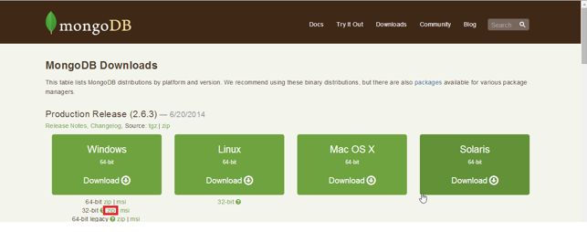
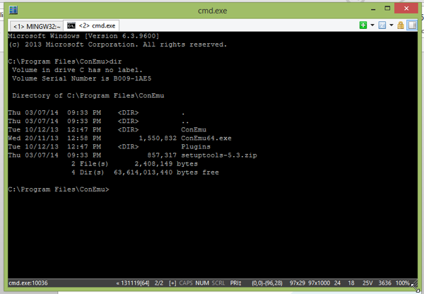
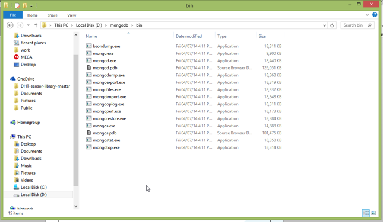
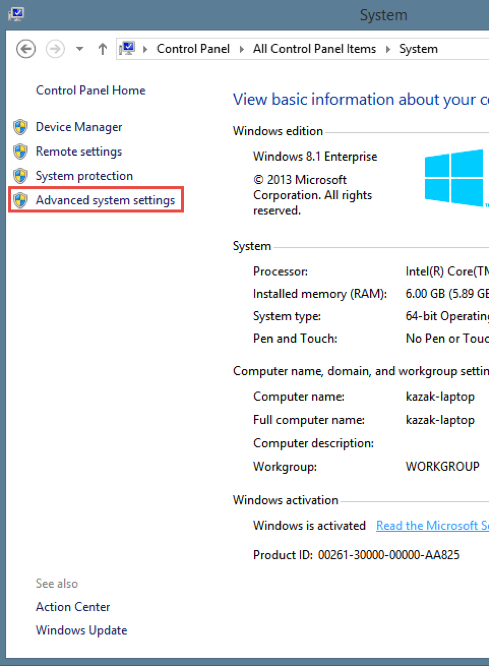
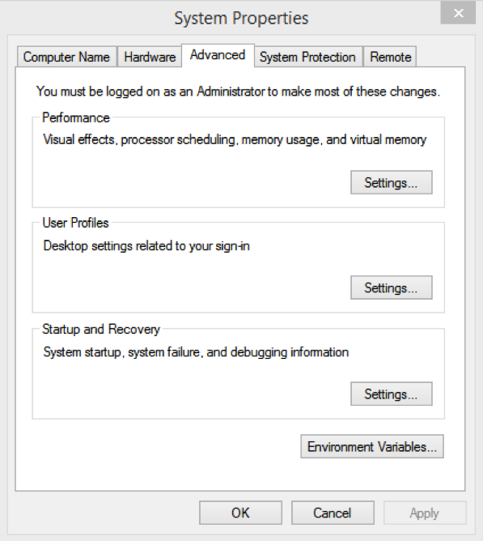
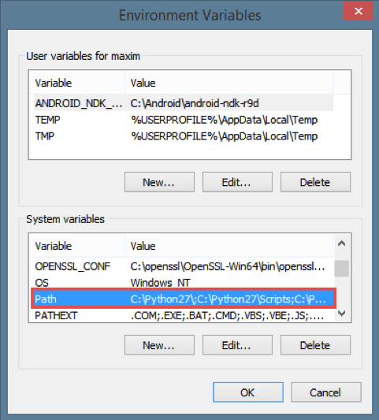
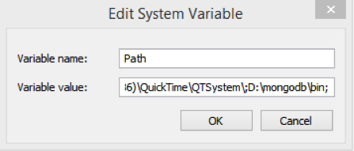
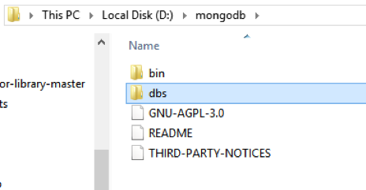

# Installation of MongoDB


## AIM

The AIM of the following paragraphs is to set up your workspace to be ready for making queries.

The steps involved will include:

1. Downloading mongoDB
2. Installing
3. Starting server
4. Running first query

Estimated Completion Time: 30	minutes 


## Step 1 : Determine Download

To download an mongoDb you need to know what operating system do you use. Then go to http://www.mongodb.org/downloads or get in File folder. You should see something like this:



## Step 2: Download

Click download under your OS. I chose an portatable version of Windows OS. And downloaded 32-bit zip. 



## Step 3: Install ConEmu

While our mongoDB is downloading you can make future work easier by installing ConEmu. This utility provide beteer terminal for windows. You can find it [here](http://www.fosshub.com/download/ConEmuSetup.140703.exe).  or get in File folder. Instal like other apps.



Now you have downloaded mongoDB distro and installed ConEmu, that going to make your work easier.

## Step 4: Unzip

Unzip downloaded archive with mongodb somewhere. I extracted it to disk D:\ and remamed to mongodb. Look at path: 



## Step 5: Windows Environment Variables


#### a) Go to **Control Panel** -> **System** -> **Advaced System Settings**

Now we need to add this folder to windows PATH variable.



#### b) Click on Environment Variables



#### c) Find Path variable in bottom list, click on it.



#### d) Append the location of the mongodb `bin` folder



#### e) Click OK and reboot



## Step 6: Set dbpath 

Run ConEmu and type the following: `mongod –dbpath D:/mongodb/dbs` and press Return. Ofcourse, --dbpath shold be yours. You should see waiting for connections line at the end of output.


## Step 7: Type a command in mongo

Open an new tab in ConEmu, or open new terminal window. This window don’t close. In new window type mongo. Now you in mongo command line. Enter the following command: 

```javascript
db.test.save({text: “hello world”});
```

If you see the following output:

```console 
WriteResult({ ("nInserted" : 1})
```

Then everything succeededy and now you can see inserted data by writing the following:

```javascript
db.test.find();
```
Notice, that “test” here – is name of our collections. And `{text: “Hello World”}` – is the document.

Congratulations. Now you can hold your own mongoDB sever and make simple queries. 

