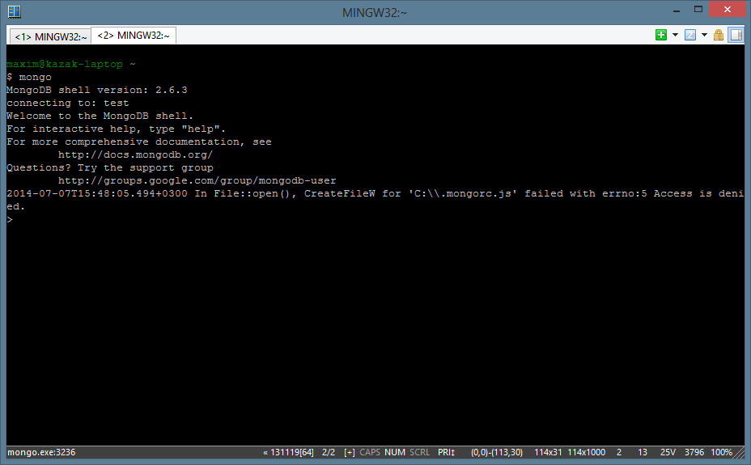

# Working in MongoDB Console

## AIM

The AIM of the following paragraphs is to learn how to add data to mongoDB and how to get values, which we need.

The steps involved will include:

1.  Creating object 
2.	Writing this object to database
3.	Finding objects
4.	Learn how to make complex queries
5.	Challenge exercise

Estimated Completion Time: 40	minutes 

#### Step 1 

Run your mongodb server, like you learned in chapter 1. Your console should show something like on Pic 2. 1 ConEmu window with started mongodb server.

#### Step 2

Here you can create objects execute JS code, insert and find data.

#### Step 3

Lets create object computer and assign it to variable c. For this write something like that:
``
varc={"computer":{"title":"asus","ram":8,"hdd":1000,"state":"new"}};
``

``
printjson(c);
``
youshould see your computer object.
This should look like this:

``
{
"computer": {
"title":"asus",
"ram":8,
"hdd":1000,
"state":"new"
  }
};
``

After that create several more objects of computer and assign them to different varriables, like that:

``
>vara={"computer":{"title":"acer","ram":3,"hdd":500,"state":"used"}};
>varb={"computer":{"title":"apple","ram":4,"hdd":750,"state":"new"}};
``

#### Step 4

Now you have some variables with computer object in them. And you can get any property from that object. Just use dot (.) to do that. For example, type this:

``
print(a.computer.state);
``
And you’ll get an result:

``
used
``
Here we called standart function “print()” to output value of state of computer object, which stored in a-variable.

Now you know how to create objects and how to get value by object’s key. 
Task completed.

#### Step 1: 
Lets write our object to db. But we want to store our computer separate, so we need to create document collection. To create it we just need to insert first value there. Let’s call our collection “computers”. Type this and look for result:

``
db.computers.save(a);
``
#### Stet 2:
Do these things for all your created objects.

#### Step 3: 
Now we’ll write to db object, that haven’t been assigned to any variable:

``
db.computers.save({"computer":{"title":"samsung","ram":2,"hdd":500,"state":"new"}})
``
As you can see, there is no matter what to write: created object, or create object just in save function. 

Now you know how to save your object to collection in db. If you don’t have that collection yet, mongoDB should create it for you. 
Task completed.

#### Step 1
Okay, we saved our data to db. But db not a black hole and we can get our data back and modify it. To get data we use find() function, executed by our collection:

``
db.computers.find();
{"_id":ObjectId("53ba9c867f50c1bfcab62a45"),"computer":{"title":"hp","ram":3,"hdd":500,"state":"used"}}
{"_id":ObjectId("53ba9d257f50c1bfcab62a46"),"computer":{"title":"apple","ram":4,"hdd":512,"state":"new"}}
{"_id":ObjectId("53baaf0a7f50c1bfcab62a47"),"computer":{"title":"acer","ram":2,"hdd":750,"state":"new"}}
{"_id":ObjectId("53baaf0d7f50c1bfcab62a48"),"computer":{"title":"asus","ram":8,"hdd":1000,"state":"new"}}
{"_id":ObjectId("53baaf107f50c1bfcab62a49"),"computer":{"title":"samsung","ram":4,"hdd":320,"state":"used"}}
``

#### Step 2
 Now we want to get just that document, which stores our apple computer:
 
 ``
 db.computers.find({"computer.title":"apple"});
{"_id":ObjectId("53ba9d257f50c1bfcab62a46"),"computer":{"title":"apple","ram":4,"hdd":512,"state":"new"}}
``

To find computer by ram, for example, you should use ‘ “computer.ram” : 4 ‘.

#### Step 3
Before we were looking for which, has equal values. What if we need to find computers with ram MORE THAN 1gb? 
Then we can use find operators. We have these operators:
$gt – Greater than

$gte – Greater then or equal to 
$lt – Less than
$lte – Less than or equal to
$ne – Not equal to
$in – Exists in array
Now we can find all computers, that have 3 or more Gb of RAM:

``
db.computers.find({"computer.ram":{$gt:3}});
{"_id":ObjectId("53ba9d257f50c1bfcab62a46"),"computer":{"title":"apple","ram":4,"hdd":512,"state":"new"}}
{"_id":ObjectId("53baaf0d7f50c1bfcab62a48"),"computer":{"title":"asus","ram":8,"hdd":1000,"state":"new"}}
{"_id":ObjectId("53baaf107f50c1bfcab62a49"),"computer":{"title":"samsung","ram":4,"hdd":320,"state":"used"}}
``

#### Step 4
Now lets find some computers, which has ram BETWEEN 3Gb and 5Gb:

``
db.computers.find({"computer.ram":{$gte:3,$lte:5}});
result will be like this:
{"_id":ObjectId("53ba9c867f50c1bfcab62a45"),"computer":{"title":"hp","ram":3,"hdd":500,"state":"used"}}
{"_id":ObjectId("53ba9d257f50c1bfcab62a46"),"computer":{"title":"apple","ram":4,"hdd":512,"state":"new"}}
{"_id":ObjectId("53baaf107f50c1bfcab62a49"),"computer":{"title":"samsung","ram":4,"hdd":320,"state":"used"}}
``
Comma in our conditional zone means AND. So you can use several conditions. 

#### Step 5 
Find elements which equals to one of the list:

``
db.computers.find({"computer.ram":{$in:[2,3,5]}});
{"_id":ObjectId("53ba9c867f50c1bfcab62a45"),"computer":{"title":"hp","ram":3,"hdd":500,"state":"used"}}
{"_id":ObjectId("53baaf0a7f50c1bfcab62a47"),"computer":{"title":"acer","ram":2,"hdd":750,"state":"new"}}
``
Now you know how to find any document, you want. And know basic operators to make this more flexible.
Task completed.

Here we’ll use some JS to make our queries more flexible and complex.

#### Step1
Lets add some shops in our collection

``
db.computers.save({shops:{title:"e-market",computers:[{computer:"apple",qty:10,price:2323.12},{computer:"hp",qty:15,price:560.30}]}});
WriteResult({"nInserted":1})
db.computers.save({shops:{title:"a-store",computers:[{computer:"apple",qty:100,price:2423.12}]}});
WriteResult({"nInserted":1})
``

Here we added 2 shops, which are selling computers.

#### Step 2
Paste this code to console and see the result.

``
var cursor = db.computers.find({
"shops": {
    $exists:true
  }
});
var a =1000000;
cursor.forEach(function (doc) {
  doc.shops.computers.forEach(function (d) {
if (d.price < a) a = d.price;
    print(d.price);
  })
});
``

In first block we defined cursor – special variable, that holds the result of db.computers.find(). And we defined find method to search for documents in which exists field “shops”.

After that we defined variable a, which stores 1000000. Than we applied forEach() method to our cursor. This method iterates all documents in cursor. As parameter, it getwhichnction, wich we wrote. Our function getting current document as parameter and applying forEach() method to computers array. Then it looking for cheapest computer and stores price in a variable. Now we know how to use JS in mongo CLI. This provide to us extremely flexible tools to search for data.
Task completed.

Now do this things to clarify your knowledge:
6.	Create new collection “movies”
7.	Add some movies there.
8.	Search for movies by actor or by genre
9.	And the most interesting task: find the title of the cheapest computer all over the shops. Use code, I provided above.

#### a) Go to **Control Panel** -> **System** -> **Advaced System Settings**

