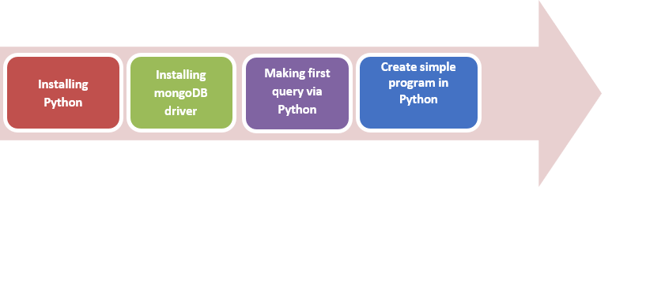
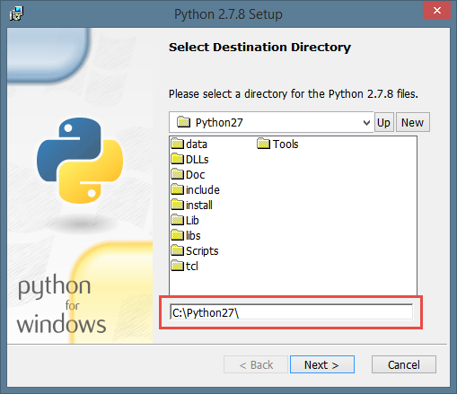
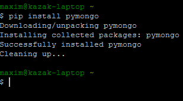

# Importing MongoDB in Python

## AIM

The AIM of the following paragraphs is to learn how to making our scripts avalible to make mongodb queries.

The steps involved will include:

1.  Installing Python
2.	Installing mongoDB driver
3.	Making first query through Python
4.	Create simple emulator of calculator work

Estimated Completion Time: 65 minutes 

**Step 1 :** Download the python. Go to https://www.python.org/ftp/python/2.7.8/python-2.7.8.msi. or get in File folder

**Step 2 :** Install python. To C:\python27, and press Next..

**Step 3 :** Include python.exe into Path variable and resume installation.

And wait for completed installation.

Task completed.

**Step 1 :** First of all we need to install pip – special tool to install python packages.
To install or upgrade pip, securely download this: https://bootstrap.pypa.io/get-pip.pyor get in Code folder.

**Step 2 :** Move that file to C:\python27 directory

Pic 3.4 Moving get-pippy file into maind python directory.

**Step 3 :** Open ConEmu and type there python C:/python27/get-pip.py
If you have already installed pip before you’ll get something like this:

Else you’ll get something like this:

**Step 4 :** Wait for finishing that command.Now we are going to install mongoDB itself.

**Step 5 :** type pip install pymongo. And wait a few seconds.

Task completed.

**Step 1 :** Now we should install some software. To code more effectively. 
a)	Download what you choose from official web-site. I’ve downloaded both. Go to http://www.jetbrains.com/pycharm/download/ and download it or get in File folder.

Pic 3.5Download pycharm main page.

b)	And go to http://www.sublimetext.com/2 and download itooor get in File folder. 

Pic 3.6 Download Sublime Text 2 main page

c)	Install them. 

You’ve installed an tool, wich will help you to code. But for now we’ll use IDLE – python editor, which distributed with python. Look for it in start menu.

**Step 2 :** Start mongoDB server, as on previous step.

**Step 3 :** Open it and write this:

``
import pymongo
client = pymongo.MongoClient('localhost',27017)
db =client.test
collection =db.computers
collection.find_one()
``

Result should be like this:

``
{u'_id': ObjectId('53ba9c867f50c1bfcab62a45'), u'computer': {u'hdd': 500.0, u'state': u'used', u'ram': 3.0, u'title': u'hp'}}
``

Here we imported pymongo library to make queries, created db variable, which stores connection to db. Than we made variable, that stores our collection. And now we can make queries. 
Task completed

**Step 1 :** Create base file in our program. And name it – calculator.py. This file take place like module to import to any program. He has no special syntax for create modules in python.

**Step 2:** Now we must think what the base operation we want to do. For first add method to read console output and perpetual cycle with always wait for our input while we not close it.ow our main function always call function read. With only read our input. Now add some logic to see what we enter, it’s number or operator or something wrong.

**Step 3:** In last code-exmaple we saw two function unary_exec()and binaty_exec(). This functions is not libraries and now we look on it’s.

How we see in this function we execute our expression and return result to console. For unary expressions we use unary_exec function that check if we not enter olny variable or only operator. And for functions +,-,*,/ we use binary_exec that execute expression and return result to console.
You can find all code in Listing #1 at the end of the document for testing it by you self.
Task complete.

Challenge exercise:

Now do this things to clarify your knowledge:
1.	Take program or do it by selft from Listing #1 (Calculator.py).
2.	Add more functionality to calculator, like increment(++) and decrement(--).
3.	Write it’s like another function, with call from read()function

 

