# Making Connectionn to Database in Scripts

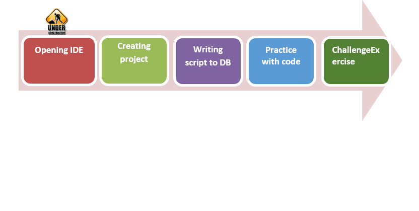

## AIM

The AIM of the following paragraphs is to learn how to write your scripts with queries to DB. 

The steps involved will include:

1.	Installing mongoDB driver
2.	Creating project
3.	Writing script to DB
4.	Practice with code

Estimated Completion Time: 45 minutes 

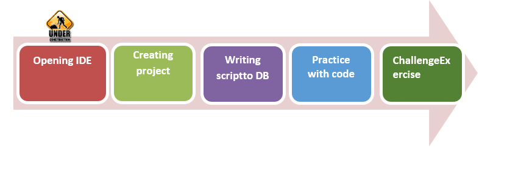

**Step 1 :** Open the IDE by searching PyCharm or Sublime in your start menu

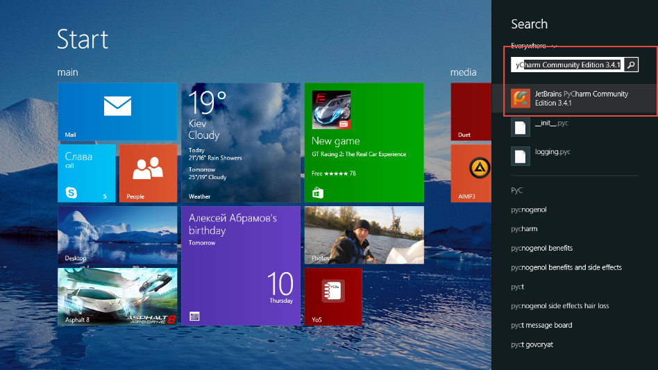
Pic 4.1 Search PyCharm

**Step 2 :** Wait some time before ide will start. It depend on your computer’s power.

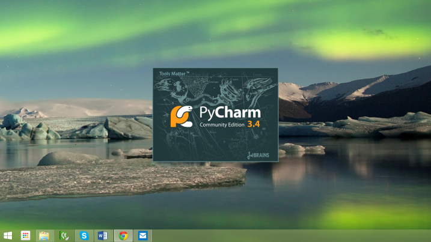
Pic 4.2 Starting PyCharm

**Step 3 :** When yourIDE will ask you from where to import settings check “I do not have previous version of PyCharm” and click Ok.

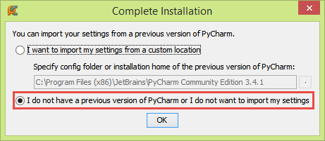
Pic 4.3 Choosing previous version

**Step 4 :** When you’l get this window:

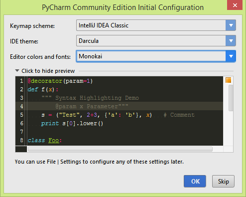
Pic 4.4 Choose main configuration for IDE

You can just press ok, or choose that theme, what you want. Keymap better to leave default.
Task completed.

heck Interpreter field. It should be C:\Python27\python.exe. Click Ok.Step 3. Wait for project being created.
Until main window will be loaded:

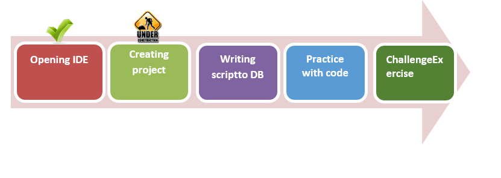

**Step 1 :** : After selecting themes you’ll be prompted to create new project:

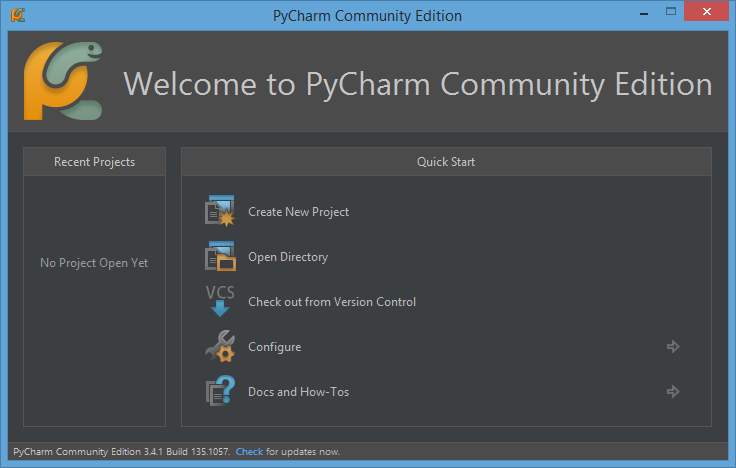
Pic 4.5 Welcome PyCharm window

Here just press “Create New Project” button.

**Step 2:** In field “Project Name” type “FirstProject”, other fields leave unchanged:

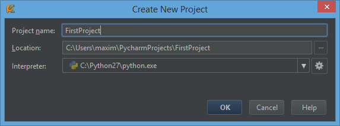
Pic 4.6 Create new project window

heck Interpreter field. It should be C:\
\python.exe. Click Ok.

**Step 3**. Wait for project being created. Until main window will be loaded:

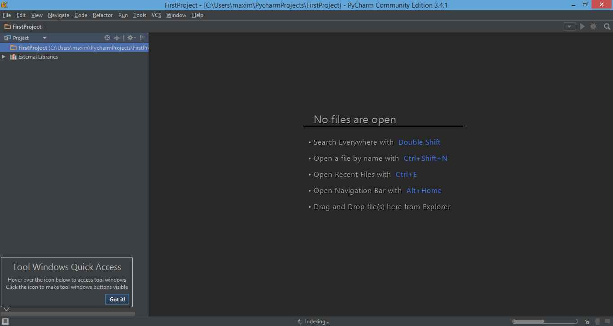
Pic 4.7 Main windows after creating new project

**Step 4:** Now you need to add new Python file toyour project. Right click on FirstProject>New>Python File. Here is explonation:

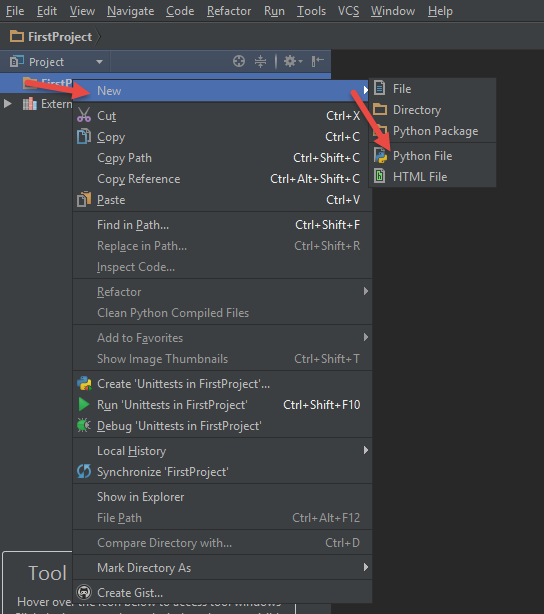
Pic 4.8 add new file into project

**Step 5:** Let’s name it Example. 
Just type the name here:

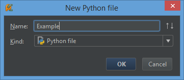
Pic 4.9 Choose type and name for new file

Now you should see this:
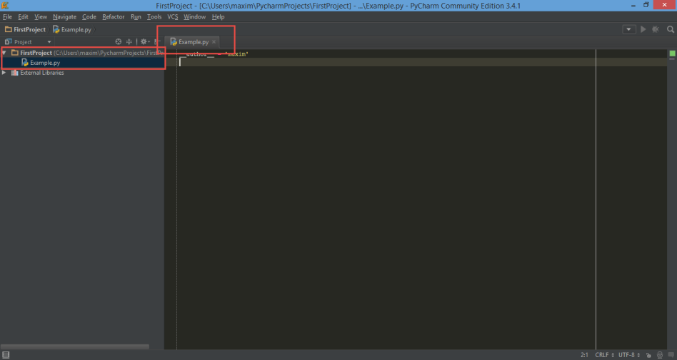
Pic 4.10 New file in main window

Task Completed

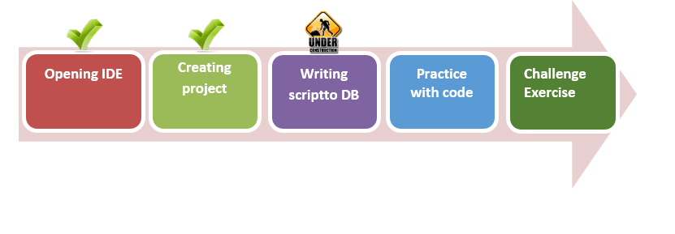

**Step 1:** Now you can write your first script.
First of all, you need to import pymongo to your project.
Type: 

``
import pymongo
``

**Step 2:** We need to create our main function, which will handle execution of all other defined function. Space some lines and type this:

``
if __name__ =="__main__":
  main()
``
This code means, than function main() will handle all code. And now we need to define our main function.

**Step 3:** Define function main():

``
defmain():
pass
``

Here we defined function main. Pass means placeholder for feature code. It does nothing, but without it we could get error, when empty main executed.

Now your code should look like this:

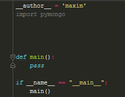

**Step 4:** Lets create an object of MongoClient

Type this above def main and under import pymongo:

``
client = pymongo.MongoClient()
``
**Step 5:** Then we need an db object. Type this just under the previous line:

``
db = client.test
``

**Step 6:** run mongodb server and try to run this scipt: press ctrl+shift+f10.In bottom of the IDE you should see this: 

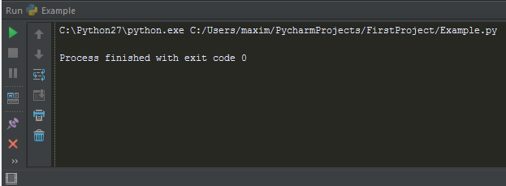
Pic 4.11 Result off executing program

IT means that connection is good. 
Screenshot of current code:

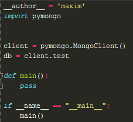

**Step 7:** Now type this under creating db object:

``
collection = db.computers
``
**Step 7:** And now final stage. We are going to insert document in our collection. Lets create an test computer document. Type this instead of pass in main():

``
computer = {"computer":{"title" : "new", "hdd": 2000,"ram": 16, "state": "new"}}
collection.insert(computer)
print collection.find_one({"computer.title": "new"})
``
in first line we created an new object of computer. In second line we inserted that object. And in the last line we checked if the object has been inserted. Here is your final code:

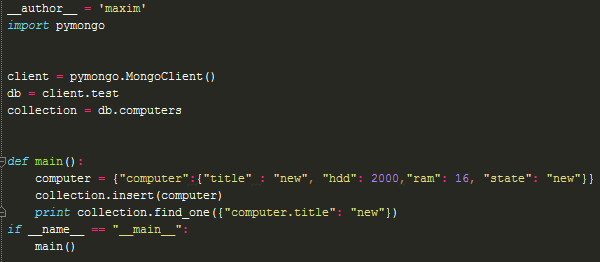

After execution of this code you will see this:

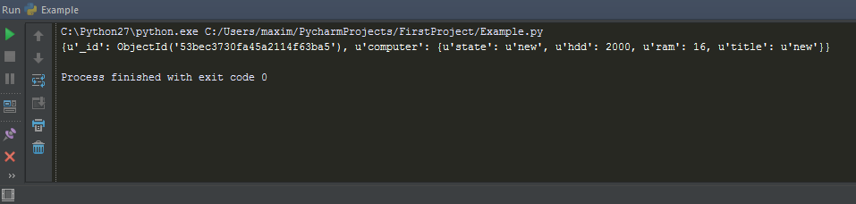

Task completed

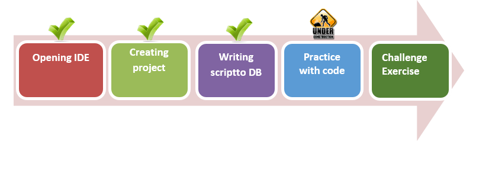

**Step 1:** Open our last project (calculator.cs) and look what we can add with our new knowledge about connection to data base and get data from it. The good idea is add memory function with safe your data in DB. At first step add connection to db in our project like function and call it from

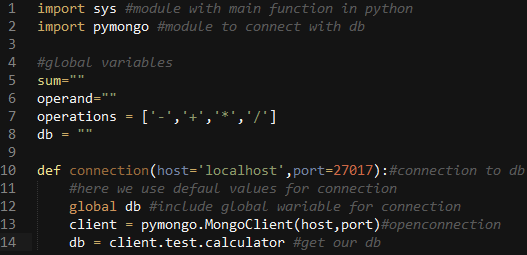

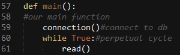

What we see here? We create new function to connect to local DB and write to global variable link to table calculator. This code look like good, but we can refactoring it. Here we only once use client variable, so we can refactoring it and do our code shorter.

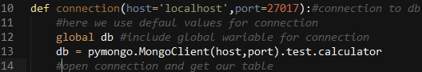

**Step 2:**Insert data to safe from program. So we need to create one more functions for it and call from read() function.

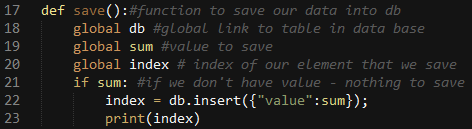
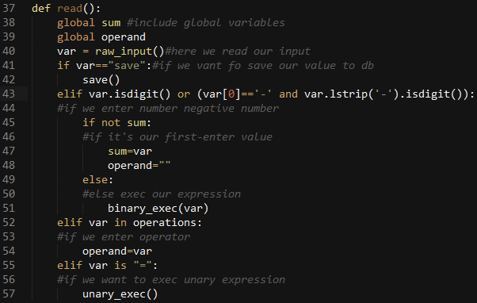

Look carefully at this code. Here we with simple string word call method save()where we insertour sumvalue with key value and for example as correct insert output to console id our value.

But in this example we have bad practice because we insert always new and new documents to db, and not delete it. We get only last value and can’t get early. All this things are check in next chapter.

Task completed

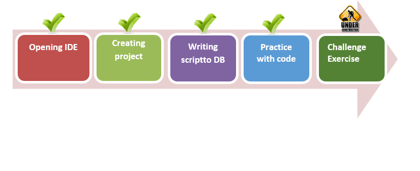

Challenge exercise

Now to clarify your knowledge make this things:
1.	Take program or do it by selft from Listing #2 (Calculator.py).
2.	Make function for get value from dbvariable.

