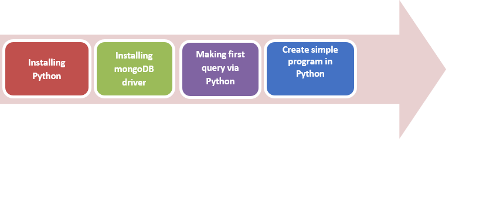
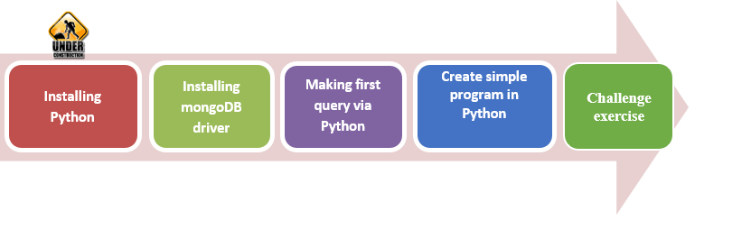
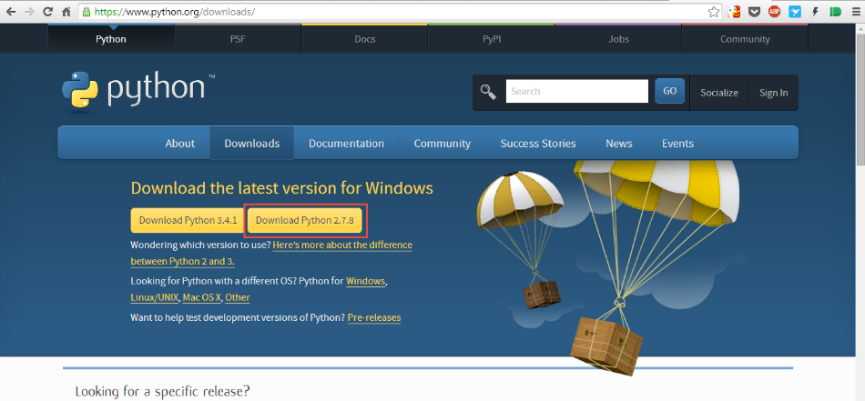
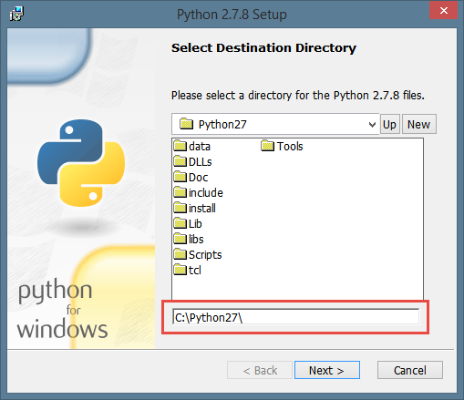
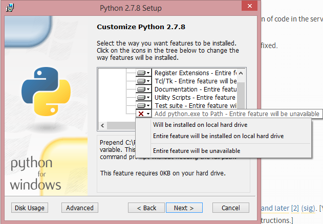
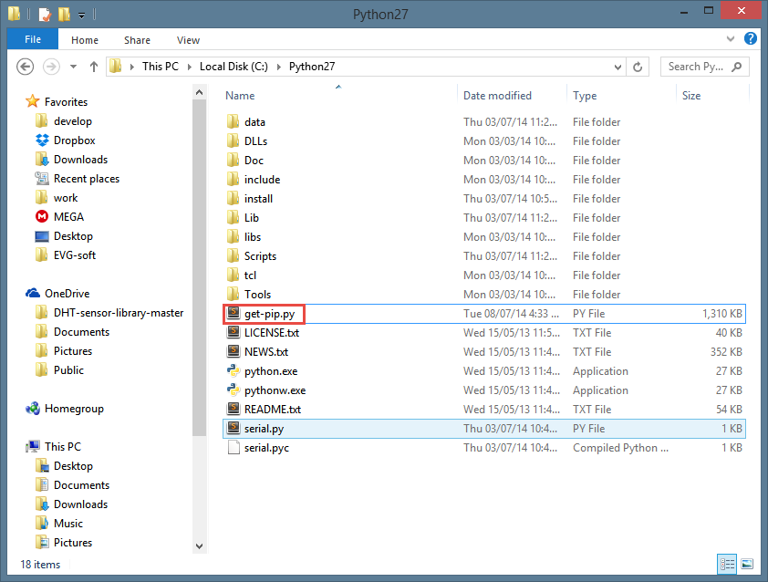

# Making Connectionn to Database in Scripts

## AIM

The AIM of the following paragraphs is to learn how to write your scripts with queries to DB. 

The steps involved will include:

1.	Installing mongoDB driver
2.	Creating project
3.	Writing script to DB
4.	Practice with code

Estimated Completion Time: 45 minutes 

**Step 1 :** Open the IDE by searching PyCharm or Sublime in your start menu

Pic 4.1 Search PyCharm

**Step 2 :** Wait some time before ide will start. It depend on your computer’s power.

Pic 4.2 Starting PyCharm

**Step 3 :** When yourIDE will ask you from where to import settings check “I do not have previous version of PyCharm” and click Ok.

Pic 4.3 Choosing previous version

**Step 4 :** When you’l get this window:

Pic 4.4 Choose main configuration for IDE

You can just press ok, or choose that theme, what you want. Keymap better to leave default.
Task completed.

heck Interpreter field. It should be C:\Python27\python.exe. Click Ok.Step 3. Wait for project being created.
Until main window will be loaded:

**Step 1 :** : After selecting themes you’ll be prompted to create new project:

Pic 4.5 Welcome PyCharm window

Here just press “Create New Project” button.

**Step 2:** In field “Project Name” type “FirstProject”, other fields leave unchanged:

Pic 4.6 Create new project window

heck Interpreter field. It should be C:\
\python.exe. Click Ok.

**Step 3**. Wait for project being created. Until main window will be loaded:

Pic 4.7 Main windows after creating new project

**Step 4:** Now you need to add new Python file toyour project. Right click on FirstProject>New>Python File. Here is explonation:

Pic 4.8 add new file into project

**Step 5:** Let’s name it Example. 
Just type the name here:

Pic 4.9 Choose type and name for new file

Now you should see this:

Pic 4.10 New file in main window

Task Completed

