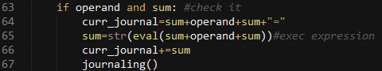

# Update and delete from database

## AIM

The AIM of the following paragraphs is to learn how to update and delete data from base in your scripts with queries to DB. 

The steps involved will include:

1.	Open our last project.
2.	Updating memory data
3.	Add journaling system
4.	Challenge exercise

Estimated Completion Time: 46 minutes 

**Step 1 :** Open our last project – calulatop.py in IDE that you love. The good idea is look through the code we have. What functionality we have? What we need to do one more? 
We have 4 binary operations - *,/,+,-
And 2 unary operations ++,--
And 2 like unary operations – unary + and –(they like binary, but add and subtract number with oneself.
 2 memory methods – get and save.

**Step 2 :** Now look at last homework that we have. For this time we mast already have method get()from DB value that we save with save method.

And here is explanation of get() method:

Here we simply get value with _idkey from dbvalue. But what we get if we start program and want to call method get()at first? We get TypeError, because we try to get from None object value withkey value.

**Step 3 :** Now we rewrite function get() to right way. We can’t create hard logic to see if there is an object with _id that we want and if that object have value. Or simply check – if our search return not None object.

Task completed

**Step 1**. Now we must correctly rewrite method save and get. At first we move up initialize index variable and then rewrite insert method to update in seve() function and move up initialize index variable.

Here we at each start of program cleaning db to removeside effect of our program. That mean that if we only start program we haven’t any save data and get() function nothing return.

**Step 2** Now rewrite function save()

Task Completed

**Step 1** Last practice for today is write journaling system. Which save all our activity.
At first we create function journaling() and curr_journallvariable.

Now add some logic for function. Create new documents data base in existing data base in function connection().

**Step 2** Now we have new DB. And we must enter here all our activity.
Inserting we have only in function journal. And we creating data to inserting in each function with work with our input data. So adding create string inserted to DB.

a)	At first do it when we enter to our program.

b)	Now create journal message in function save 

c)	and get data from DB.

d)	And in our logic operations (binary).

e)	And unary

**Step 3** Now update our function journaling()to save our curr_journal.

As you see, now we delete including global variables sum and operand. Because all data that we must save, already existing in curr_journalvariable.

Task completed

Challenge exercise:
Add to program in Listening #3 possibility see all journal or some count message from journal DB.

