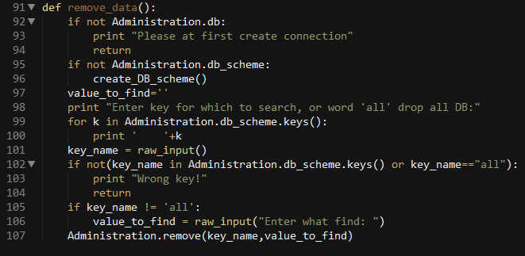

# Advanced Search in DB

## AIM

The AIM of the following paragraphs is to learn how to advanced search in DB in your scripts and how made internet application.

The steps involved will include:

1.	Create simple DB IDE
2.	Introduction to bottle
3.	Challenge exercise

Estimated Completion Time: 70 minutes 

Now we create simple IDE for DB. Where we can create DB, easy insert remove and find data. This application is Console too, but now we create it in different files. Let’s start…

**Step 1.** At first create a folder for our project in any place in your computer(desirablenot in disk where placed you current file system). Now create three files: maip.py, Administration.py, Functionality.py.

1.  main.py – here is start our program
2.	Administration.py – this module for work with DB
3.	Functionality.py – this module for all our logic 

Now start work with main.py. Write main()function inside:

As you see here we have simple manipulation, our Console IDE. Where we always wait for user input, and see what he enter, what operation. Functionality – we import here another file like a module and work with it. Here is a block schema for program:

User – work in module main.py, Administartion module – work with our DB, and have requests from from Functionality, which get data from user.

**Step 2.** Create connection()function in Administration.py file.

Here is two global variables. db – for pymongo DB collection, and db_scheme – for inserting JSON collection into DB. Connection – get three parameters. Where db_name is name of DB which we want to work now. Another two parameters is optional parameters, for create connection to mongodb.

**Step 3.** Now create find() function for finding.in DB. We call this method from Functionality.py file. 
 
 
 
We have two parameters – key and value. For finding data in DB. If key has value ‘all’ we return all in DB. Else find all matches with valueparameter. And print that now.

**Step 4.** Now we create save() function. For inserting our JSON objects.

 
 
 **Step 5.** Now create remove()function for removing rows or drop all existing DB.
 
  
  
  In this function we can drop existing DB if keyequals ‘all’, or rows where matched our key-value pair.
  
 **Step 6.** And last function in Administartion module is update().
 
 
 
 Here we simply updates all matched values.
 
 **Step 7.** Now we write Functionality.py file with all logic for Simple DB IDE
 program. At first import Administration.py file where was all work with DB.
 
  
  
  **Step 8.** Now create function for connection to DB, using Administration.py
  
  
  
  And function to show all users command:
  
   
  
       
**Step 9.** For creating simple JSONs object we must have scheme, so create function for it.

  
    
    
 **Step 10.** Now we can create function for inserting data into DB
   
   

Here we check connection and availability structure, than insert value for each key,except “_id”. And call Administation function save().

**Step 11.** Now we create finding function.

 
 
 __search – function for search. It’s become a function because we use it in many functions.
 
  
  
  
**Step 12.** Now create function for change data in DB

As you see we call _seach() function here too. And then updatefunction from Administration.py module.

**Step 13.** Now the last function is – remove. For removing data or drop all existing DB.

Task Completed

**Step 1.** Bottle is a fast, simple and lightweight WSGI micro web-framework for Python. It is distributed as a single file module and has no dependencies other than the Python Standard Library.

Routing: Requests to function-call mapping with support for clean and dynamic URLs.
Templates: Fast and pythonic built-in template engine and support for mako, jinja2 and cheetah templates.

Utilities: Convenient access to form data, file uploads, cookies, headers and other HTTP-related metadata.

Server: Built-in HTTP development server and support for paste, fapws3, bjoern, Google App Engine, cherrypy or any other WSGI capable HTTP server.

**Step 2.** Let’s write simple example with bottle.

Run this script or paste it into a Python console, then point your browser to http://localhost:8080/hello/world. That’s it.

Task Complete

**Challenge Exercise**

Find in program from Listening #4not less 3 vulnerableplace and fix it.

  

  