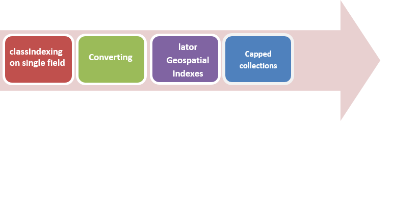
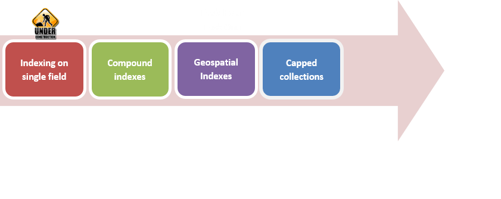
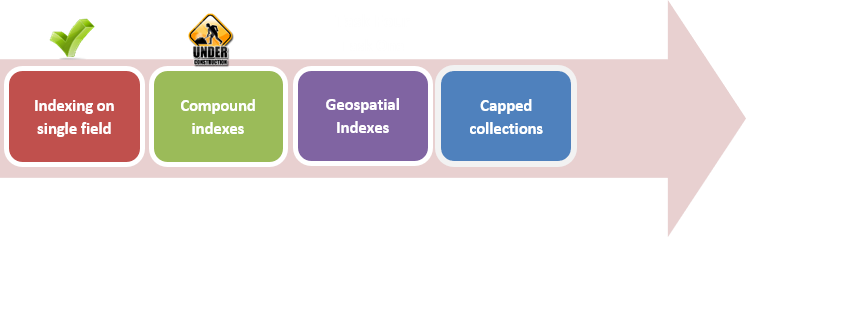
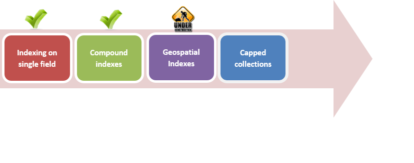
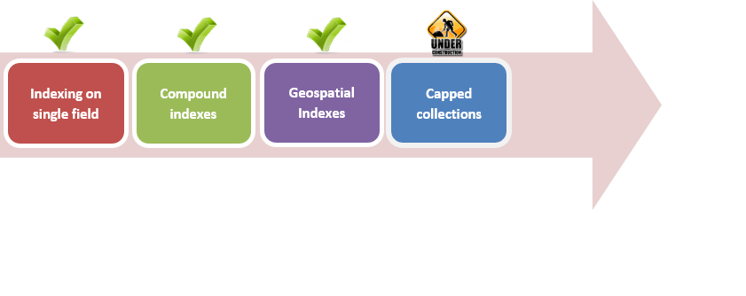

# Importing MongoDB Query Optimization

## AIM

The AIM of the following exercise

The steps involved will include:

1.  Indexing on a single field
2.	Working with compound indexes
3.	Working with Geospatial indexes
4.	Capped collections

Estimated Completion Time: 65 minutes 

Performance is the one of the most significant characteristic of database. To improve it, you can use the indexing.

In the following task we will try to understand how indexing works and check its influence to the query execution speed

**Step 1 :** Firstly, let's connect to an already running database server:

``
from random import * 
from pymongo import *
client = MongoClient()
db = client.test
``

We use default connection and database named “test”

**Step 2 :** We need some collection for testing indexing. This collection should be large enough to get an appreciable difference between queries with and without index.

``
for i in xrange(50000):
  db.index_test.insert({"a":randint(0,1000),"b":randint(0,1000),"c":randint(0,1000)}) 
``

Each document in the collection consists of three fields: a, b and c. These fields, named without imagination, keep random numbers from 0 to 1000. 

**Step 3 :** Start with simple “find” query.

a)	To know how the query is performed, we use “explain” method. This method returns specific information about query handling process.

``
res = db.index_test.find({"a":42}).explain()
print_query_info(res)
``

b)	To output information about query we have created a new function, and call it after each query. This function gets the result of “explain()” method.

``
pattern ="Result time: {0}, scanned: {1}, read full documents :{2} cursor type: {3}, index only: {4}"
 
def print_query_info(res):
print pattern.format(res["millis"], res["nscanned"], res["nscannedObjects"], res["cursor"], res["indexOnly"])
``

From given information, we print only query performing time, number of checking documents, number of fully scanned documents, cursor type (index cursor or basic cursor), and a boolean value that reflects using of collection. If an index covers a query, there is ability to return result using index only and then indexOnly flag is set to True.

Result:

``
Result time: 25, scanned: 50000, read full documents :50000 cursor type: BasicCursor, index only: False
``

Let's analyze the result. Operations took 25 milliseconds. There are 50000 checked documents and 5000 read documents (you will see the difference between these concepts after indexing). The cursor has base type. Index only flag is set to False. This flag is unimportant to us now.

c)	As, this simple query takes a while, there is able to make it faster.

``
index_name = db.index_test.create_index("a")
``

“create_index” method creates an index on the given field. You might specify index name, otherwise, mongodb will create name automatically. This method returns the specified or generated index name.

``
print index_name
``

Result:

``
a_1
``

d)	Let's search again to see an impact on performance:

``
res = db.index_test.find({"a":42}).explain()
print_query_info(res)
``

Result:

``
Result time: 0, scanned: 48, read full documents :48 cursor type: BtreeCursor a_1, index only: False
``

Execution time is greatly reduced. Cursor type is changed from “Basic Cursor” to “ BtreeCursor”

Each document in the index contains the value of field “a” and reference to the document from “index_test” collection from where this value is. “find” process selects 48 documents which match query . Using references in these documents, process goes to the “index_test” collection, read the full version of documents and return them.” Index only” flag is still false, because during the “find” process we employ “index_test” collection.

e)	If our requested values are fully covered by index, process returns values straightly from it, without using other collections. 

``
res = db.index_test.find(spec ={"a":42}, fields ={"a":True,"_id" : False}).explain()
print_query_info(res)
``

We request for only “a” field, which might be returned directly from index collection. There are no documents read from “test_index”. “Index only “ flag is set to true

Result:

``
Result time: 0, scanned: 48, read full documents :0 cursor type: BtreeCursor a_1, index only: True
``

**Step 4.**  Indexing takes a lot of advantages in sorting:

a)	Sorting by unindexed field. To sort collection, you must specify “sort” parameter as a list of (key, direction) pairs

``
res = db.index_test.find(sort =[("b", ASCENDING)]).explain()
print_query_info(res)
``

Result:

``
Result time: 250, scanned: 50000, read full documents :50000 cursor type: BasicCursor, index only: False
``

b)	Sorting by indexed field:

``
res = db.index_test.find(sort =[("a", ASCENDING)]).explain()
print_query_info(res)
``

Result:

``
Result time: 54, scanned: 50000, read full documents :50000 cursor type: BtreeCursor a_1, index only: False
``

Almost fivefold increase in the rate

**Step 5.**  It's time to test “find” and “sort” together:

a)	Fields in query are both not indexed.

``
res = db.index_test.find(spec ={"c":10}, sort =[("b", ASCENDING)]).explain()
print_query_info(res)
``

Result:

``
Result time: 23, scanned: 50000, read full documents :50000 cursor type: BasicCursor, index only: False
``

b)	Now, let's try to sort the collection by indexed field:

``
res = db.index_test.find(spec ={"c":10}, sort =[("a", ASCENDING)]).explain()
print_query_info(res)
``

You may think this query can be faster, but it can not.

``
Result time: 66, scanned: 50000, read full documents :50000 cursor type: BtreeCursor a_1, index only: False
``

The whole point is that in the previous query the “find” operation had performed at first, and then sorting of selected items. But, in this query, process sorts all documents by “a” field, and then chooses those that match the query.

c)	If you decide to sort collection by several fields, and one of the fields is indexed, this index will not be used.

``
res = db.index_test.find(sort =[("a", ASCENDING),("b", ASCENDING)]).explain()
print_query_info(res)
``

Result:

``
Result time: 299, scanned: 50000, read full documents :50000 cursor type: BasicCursor, index only: False
``

The cursor has “Basic Cursor” type. So the operating time is quite large.To improve it, use compound index.

d)	To create compound index, needed fields should be passed as an array. 

``
index_name = db.index_test.create_index([("a", ASCENDING),("b", ASCENDING)])
``

e)	Query again and see the difference in time:(pls check thereare 2images)

``
res = db.index_test.find(sort =[("a", ASCENDING),("b", ASCENDING)]).explain()
print_query_info(res)
``

Result:

``
Result time: 67, scanned: 50000, read full documents :50000 cursor type: BtreeCursor a_1_b_1, index only: False
``

**Step 6.**  You can also explicitly specify, which index must be used. For this purpose, use “hint” method.

``
res = db.index_test.find(sort =[("a", ASCENDING),("b", ASCENDING)]).hint([("a",1)]).explain()
print_query_info(res)
``

Result:

``
Result time: 351, scanned: 50000, read full documents :50000 cursor type: BtreeCursor a_1, index only: False
``

We forced the query optimizer to use an index on the field “a”. And it makes the query slower.

**Step 7.**  If you don't know which indexes are created on the collection, “index_information” method call will clarify the situation.

``
print db.index_test.index_information()
``
Result:

``
{u'_id_': {u'key': [(u'_id',1)], u'v': 1},
u'a_1_b_1': {u'key': [(u'a',1),(u'b',1)], u'v': 1},
u'a_1': {u'key': [(u'a',1)], u'v': 1}}
``
**Step 8.** If you decide, that index is already not needed, you can drop it.

a)	Drop single index by name:
``
db.index_test.drop_index(index_name)
``

b)	Or drop all indexes:
``
db.index_test.drop_indexes()
``

The method above drops all indexes unless on “_id” field.

c)	See index information again:
``
print db.index_test.index_information()
``

Result:
``
{u'_id_': {u'key': [(u'_id',1)], u'v': 1}}
``

Task completed

In addition to usual indexes, mongodb offers geospatial indexes, that handle geospecial information. geospecial information is contained as a list of two items:
longitude and latitude.

**Step 1.** We have a collection of places. Each place has name, address, contact phone and location.

``
db.interest_places.insert({"name":"Cafe","location":[0,2],"address":"1239 First St","contact phone":1234})
db.interest_places.insert({"name":"Restaurant","location":[10,4],"address":"1024 Prytania St","contact phone":1231})
db.interest_places.insert({"name":"Filling station","location":[13,8],"address":"1210 St Andrew St","contact phone":9999})
db.interest_places.insert({"name":"Hostel","location":[0,11],"address":"1022 Orange St","contact phone":3333})
db.interest_places.insert({"name":"Pizzeria","location":[6,23],"address":"1099 Euterpe St","contact phone":5654})
db.interest_places.insert({"name":"Bowling club","location":[10,26],"address":"1033 Thalia St","contact phone":8812})
``

**Step 2.**  To enable all benefits of using geospatial field(e.g. search near the point, sort by distance to point), you have create an index on this field.

``
db.interest_places.create_index([("location", GEO2D)])
``

**Step 3.**  The task we will solve in the following function, is to find places nearest given point, sorted by distance.

``
def get_nearest_objects(lng, lat, max_distance=100):
``

a)	In the first place, we print given location:

``
print"You are here {0},{1}. The nearest places are: ".format(lng, lat)
``

b)	The function above is followed by a query to database. We can find documents near another point, or query for all items within circle (specified by center point and radius). The difference between them consists on returning documents in sorted order by “near” query.

``
for place in db.interest_places.find({"location": [("$near",[lng, lat]),("$maxDistance", max_distance)]}):
``

SON object is used, because order of passed options is important. By default, documents, returned by this query are ordered by distance to the given location.

c)	To print all wishful information, the next template is used:

``
template ="name : {0}, contact phone : {1}, address : {2}, distance to place : {3}"
``

d)	The template is formatted by returned documents.

``
print template.format(place["name"], place["contact phone"],place["address"],calculate_distance(lng, lat, place["location"][0], place["location"][1]))
 ``

e)	The next task is to calculate distance between two points.

``
def calculate_distance(x1,y1,x2,y2):
return sqrt((x2 - x1)**2 + (y2 – y1)**2)
``

The function calculates using the distance formula.

**Step 4.**  So, all is in readiness, and we test our function:

a)	Get nearest objects

``
get_nearest_objects(0,0,40)
``

Result:

``
You are here 0,0. The nearest places are:
name : Cafe, contact phone : 1234, address : 1239 First St, distance to place : 2.0
name : Restaurant, contact phone : 1231, address : 1024 Prytania St, distance to place : 10.7703296143
name : Hostel, contact phone : 3333, address : 1022 Orange St, distance to place : 11.0
name : Filling station, contact phone : 9999, address : 1210 St Andrew St, distance to place : 15.2643375225
name : Pizzeria, contact phone : 5654, address : 1099 Euterpe St, distance to place : 23.769728648
name : Bowling club, contact phone : 8812, address : 1033 Thalia St, distance to place : 27.8567765544
``

b)	Now get neares objects

``
get_nearest_objects(10,5,5)
``

Result:

``
You are here 10,5. The nearest places are:
name : Restaurant, contact phone : 1231, address : 1024 Prytania St, distance to place : 1.0
name : Filling station, contact phone : 9999, address : 1210 St Andrew St, distance to place : 4.24264068712
`` 

Another concept, offered by Monodb to improve performance, is using capped collections. For example, log collection. We are interested only in last events, so there is no reason to to keep all log events in the collection. For this purpose, we can use capped collection.

Task completed.

**Step 1** .It's very easy to create capped collection. You should only specify it, during collection is creating.

``
db.create_collection(name ="log", capped =True,max=5, size =524288000)
``
 “max” option means the maximum number of documents in the collection, “size” is the maximum size in bytes.
 
**Step 2.** Fill collection with simple events:

``
for i in xrange(100):
  db.log.insert({"Event": "Added number " + str(i)})

``

**Step 3.** And print all of them:

``
for event in db.log.find():
print event["Event"]
``

Result:

``
Added number 95
Added number 96
Added number 97
Added number 98
Added number 99
``

As you can notice, collection contains only five last added documents and they returned in the insertion order. 

**Step 4.** To get the recent events use reverse order of documents:

``
print"Reverse insertion order"
for event in db.log.find().sort([("$natural", -1)]):
print event["Event"]
``

Result:

``
Reverse insertion order
Added number 99
Added number 98
Added number 97
Added number 96
Added number 95
``

 	
 
 

