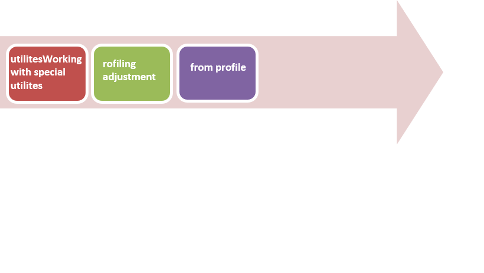
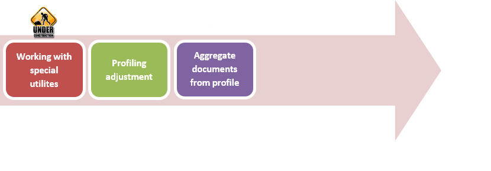
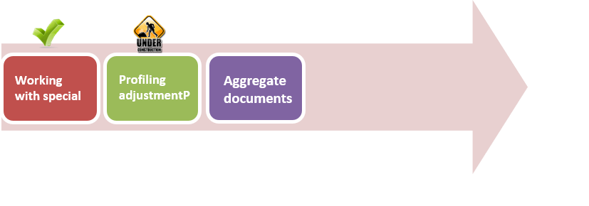
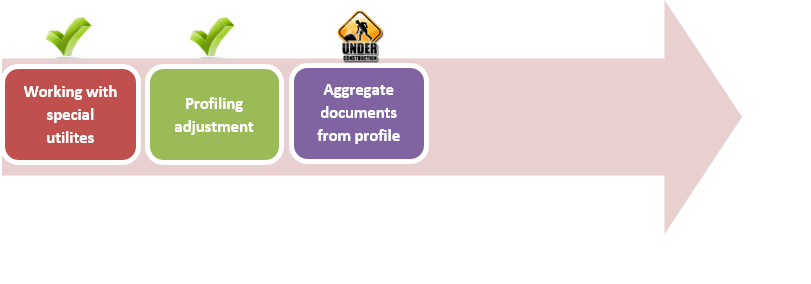

# Monitoring Tools

## AIM

The AIM of the following exercise

The steps involved will include:

1.  Working with special utilities
2.	Profiling adjustment
3.	Aggregate documents from the profile

Estimated Completion Time: 60 minutes 

The two main utilities, provided in mongodb package are mongotop and mogostat.

**Step 1.** Try these utilities

a)	Run mongodb server
``
mongod --dbpath c:\Mongodb\dbs
``

b)	And launch these utilities:

``
mongotop
connected to: 127.0.0.1
    ns    total    readwrite
    admin.system.indexes     0ms     0ms     0ms
     admin.system.roles     0ms     0ms     0ms
     admin.system.users     0ms     0ms     0ms
    admin.system.version     0ms     0ms     0ms
     local.startup_log     0ms     0ms     0ms
    local.system.indexes     0ms     0ms     0ms
    ``

As you see, there are no active read or write operations now.

``
mongostat
connected to: 127.0.0.1
insert query update delete getmore command flushes mapped vsize  res faults locked db idx miss %   qr|qw  ar|aw netIn netOut conn time
*0*0*0*001|00  160m  484m  44m   0 test:0.0%00|00|0  62b   3k   111:00:59
You can see, the number of each type of operations per second, number of commands, size of memory used by process, global write lock time and other. These values will vary during server load.
``

Task completed.

**Step 1.**  Mongodb provides a handy logging tool named Profiler. 
We will create a simple class, the purpose of which consists onautomatizing the working with profiler.

a)	Begin class definition from “__init__” method.

Our class contains reference to database, logging level and “slow” threshold that determines a minimally query execution time to be added to profiler. 

``
class Profiler:
def__init__(self, db):
  self.db= db
  self.log_level=1
  self.slowms=100
  ``
  
By default log_level is set to “1”(slow operations only), and “slow” threshold is set to 100 milliseconds.

b)	The next method is to enable profiling:

``
def enable_profiling(self, level =1, slowms =100):
  self.db.set_profiling_level(level, slowms)
  self.log_level= level
  self.slowms= slowms
 ``
 
Profile tuning is implemented by “ set_profiling_level” method.

We save new options to profile and to our object fields. These options will be used further

c)	The next method disables profiling.

``
def disable_profiling(self):
  db.setProfilingLevel(0)
  self.log_level=0
``

We only set level to “0”.

d)	The default size of system.profile collection is 1 megabyte. If you want to change this size(increase or decrease) for some reason, you should disable profiling, drop the profiler collection, create a new collection. Re-enable profiling.

We have written everything below into one method:

``
def increase_log(self, new_size):
  db.setProfilingLevel(0)
  db.system.profile.drop()
  db.createCollection("system.profile",{"capped": "true","size":new_size})
  db.setProfilingLevel(self.log_level,self.slowms)
 `` 

The method takes the new size of the system.profile collection. We use “log_level” and “slowms” saved earlier to restore previous profiler options.

Task completed.

**Step 1.**  The following methods are covered to show a structure of documents, contained in the system.profile collection.

a)	For example, you want to group all documents by date, to see most queries days.

``
def gruop_by_date(self):
return db.system.profile.aggregate(
[
{"$project": {
"day": {'$dayOfMonth': '$ts'},"month": {'$month':'$ts'},"year": {'$year':'$ts'},
"millis" : "$millis"
}},
``
``
{"$group": {
"_id": {"day":'$day',"month":'$month',"year":'$year'},
"count": {"$sum": 1},
"sum_mills": {"$sum": '$millis'}
}}, 
{"$project": {"_id": 0,"date": '$_id',"queries": "$count",
"avg" : {"$divide": ["$sum_mills","$count"]}}}
]
)
``

In the first stage, we split date of operation into day , month and year. Date of operation is contained in the “ts” field.

Then, we group documents by unique combinations of day, month and years, calculate the number of documents for each date and sum their execution time(contains in the “millis” field). To get an average case of execution time, total sum of time must be divided by the number of documents.

b)	It is sometimes convenient to get a histogram of queries' time. Execution time will be spited with user-defined step.

``
def gruop_by_exec_time(self, milliseconds):
return db.system.profile.aggregate(
[
{"$project": {
'ms': {'$subtract':['$millis',{"$mod":['$millis', milliseconds]}]}
}},
{"$group": {
"_id" : '$ms',
"count" : {"$sum":1}
}}
]
)
``

In the first stage we round execution time to nearest multiply of passed value. Then we group by this value.

c)	There is a simple way to see which namespace (database. collection) is the most queries.

``
def group_by_collect(self):
return db.system.profile.aggregate(
[
{"$group": {
"_id" : '$ns',
"count" : {"$sum":1}
}}
]
)
``

Each document in the system.profile collection, contains namespace in wich there is this document in the “ns” field.

d)	Also, there is ability to group by operation type, contained in the “$op” field. The possible values are: insert, query, update, remove, getmore, command.

``
def group_by_oper_type(self):
return db.system.profile.aggregate(
[
{"$project": {
"type": "$op",
"millis" : "$millis"
}},
{"$group": {
"_id": "$type",
"count": {"$sum": 1},
"sum_mills": {"$sum": '$millis'}
}}, 
{"$project": {"_id": 0,"type": '$_id',"queries": "$count",
"avg" :{"$divide": ["$sum_mills","$count"]}}}
]
)
``

As in the previous methods, firstly we group and sum and then, get the average case of time.

**Step 2.**  Let's connect to already running mongod instance:

``
from pymongo import *
from random import *
client = MongoClient()
db = client.test
``

Create our profiler object and set profiling level:

``
from simple_profiler import Profiler
p = Profiler(db)
p.enable_profiling(level=1, slowms=10)
``

**Step 3.**  We should create some collection for testing

``
for i in xrange(10000):
  db.stuff.insert({"people_id":i,"salary":randint(0,10000)})
  ``
  
And make few “heavy” queries:

1)	Get all salary where they is grather than 7000 but less than 7500 and sort by people_id field:

``
orkers = db.stuff.find({"salary" : {"$gt":7000,"$lt":7500}}).sort("people_id")
print workers[0]
``

Result:

``
{u'salary': 7415, u'people_id': 128, u'_id': ObjectId('5420ae39d2fac11379328e69')}
``
2)	Get item where people_id is equal 5000:

``
worker = db.stuff.find({"people_id" : 5000})[0]
print worker
``

Result:

``
{u'salary': 5980, u'people_id': 5000, u'_id': ObjectId('5420acd0d2fac11305cff159')}
``

3)	Get item where people_id 6000 and set into salary value 9998:

``
res = db.stuff.update({"people_id" : 6000},{"$set":{"salary" : 9998}})
print res
``

Result:

``
{'updatedExisting': True, u'nModified': 0, u'ok': 1, u'n': 1}
``

The queries above, without indexes, iterate half of collection to find needed documents, and time spent on this, may be more than 10 milliseconds.

**Step 4.**  Test the methods of our class:	

a)	Group by date:

``
print p.gruop_by_date()
{u'ok': 1.0, u'result': [
{u'date': {u'month': 9, u'day': 22, u'year': 2014}, u'avg': 18.0, u'queries': 10}]}
``

b)	Group by namespace:

``
print p.group_by_collect()
{u'ok': 1.0, u'result': [
{u'count': 10, u'_id': u'test.stuff'}]}
``

c)	Group by execution time:

``
print p.gruop_by_exec_time(10)
{u'ok': 1.0, u'result': [
{u'count': 4, u'_id': 10},
{u'count': 6, u'_id': 20}]}
``

d)	And group by operation:

``
print p.group_by_oper_type()
{u'ok': 1.0, u'result': [
{u'avg': 20.0, u'type': u'update', u'queries': 1},
{u'avg': 17.0, u'type': u'query', u'queries': 1},
{u'avg': 17.875, u'type': u'insert', u'queries': 8}]}
``

Task completed. 

