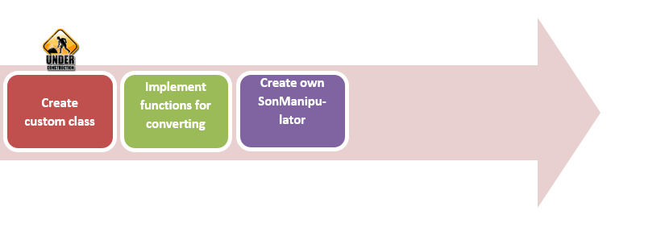

# Custom Data Types

## AIM

The AIM of the following exercise

The steps involved will include:

1.  Creating a custom class
2.	Implementation of functions that transform the custom class to binary datatype.
3.	Creating a SonManipulator

Estimated Completion Time: 50 minutes 

The mongodb is the schemaless database so you can contain any fields with any types provided by BSON. But what if you need to keep data in your own data type? 

For example, any text data are contained by mongodb as string. Sometimes it is not acceptable, because its len may exhaust limit size of document. This task has three solutions: divide text into parts, keep text data in gridfs or compress it. We consider third way.

**Step 1.** . As pymongo and mongodb have not data type for containing compressed data with automatic compressing/decompressing we will create custom data type which implements these features.

a)	Firstly, let's create custom data class:

``
class CompressedText():
	def __init__(self, text):
		self.__text = text
	def text(self):
		return self.__text
        ``

This class has only one field - with text intended for archiving. The purpose of the class' methods is oblivious: the first one is the constructor which takes a text, and second one returns the text.
 
Task completed.

**Step 1.**  Next two functions responsible for converting our class to binary and from. In these functions you may transform data as you think fit. 

a)	First one function converts text data to the BSON "BinData" datatype. Before converting we compress it using zlib compression library from GNU.

``
def to_binary(custom):
  compressed =zlib.compress(custom.text())
``

b)	The following operator prints data len: before and after compressing 

``
print"initial len: {}, compressed: {}".format(len(custom.text()),len(compressed))
``

c)	The final step is the convertation itself. Binary values have subtype. This is used to indicate what kind of data is in the byte array. Subtypes from zero to 127 are predefined or reserved. Subtypes from 128-255 are user-defined. The 128 subtype is used by us.

``
return Binary(compressed,128)
``

**Step 2.**  The second one function decompresses the data in string and instantiate an object of “ CompressedText” class with this string. 

``
def from_binary(binary):
	return CompressedText(zlib.decompress(binary))
    ``
    
**Step 3.**  If we try to save an instance of custom class, we’ll get an exception:

``
InvalidDocument: Cannot encode object: <__main__.CompressedText instance at 0xb6cc552c>
``

This is because pymongo does not know how “CompressedText” type covert to binary.

Task completed.

**Step 1.**  We must explicitly state which functions should be invoked when custom type is saving. We can do it by creating a newSONManipulator.SONManipulatoris the manipulator that saves and restores objects without changing them. 

Next class is inherited from “SONManipulator”class and overrides two methods: ” transform_incoming” called when a document is saved and “ transform_outgoing” called when a document is retrieved. In other words, next manipulator will be used by each “insert”/”find” operation.

a)	When“insert” operation is running, the document passing to ” transform_incoming” method as “son” parameter, and the collection the document is being inserted into as “collection”, respectively.

``
 class TransformToBinary(SONManipulator):
	def transform_incoming(self, son, collection):
		for(key, value)in son.items():
			if isinstance(value, CompressedText):
``

We iterate over the fields of saving document and looking for a “ CompressedText” instance. 

b)	If it is found, we convert “ CompressedText” instance to binary data type by “to_binary” function, defined before.

``
son[key]= to_binary(value)
``
c)	Else, if the value has a dictionary type, we recurse into sub-docs.
elif isinstance(value,dict): 

``
   son[key]=self.transform_incoming(value, collection)
``

d)	Finally, the result document must be returned.

``
return son
``

**Step 2.**  The “ transform_outgoing” method has similar signature: method takes “self” parameter, document, retrieved from database, and the collection this collection was stored in. We don't use collection name not in previous method nor in this method.

``
def transform_outgoing(self, son, collection):
	for(key, value)in son.items():
    ``

Unlike the previous method, each document is checked for binary data with subtype 128.

``
if isinstance(value, Binary)and value.subtype==128:
  son[key]= from_binary(value)
elif isinstance(value,dict):
  son[key]=self.transform_outgoing(value, collection)
return son
``

**Step 3.**  Now, the manipulator should be added to target database.

``
db.add_son_manipulator(TransformToBinary())
``

The SONManipulatoris affected per database, so if you want to use it in another database, you just add it to the desired one.

**Step 4.**  Let's archive some information.

a)	The following text is the definition of MongoDB from wiki.

``
what_mongo_is="""
MongoDB (from humongous) is a cross-platform document-oriented database. Classified as a NoSQL database,
MongoDB eschews the traditional table-based relational database structure in favor of JSON-like documents
with dynamic schemas (MongoDB calls the format BSON), making the integration of data in certain types of
applications easier and faster. Released under a combination of the GNU Affero General Public License and
the Apache License, MongoDB is free and open-source software.First developed by the software company 10gen
(now MongoDB Inc.) in October 2007 as a component of a planned platform as a service product, the company
shifted to an open source development model in 2009, with 10gen offering commercial support and other services.
[1] Since then, MongoDB has been adopted as backend software by a number of major websites and services 
, including Brave Collective, Craigslist, eBay, Foursquare, SourceForge, Viacom, and the New York Times,
``

``
among others. MongoDB is the most popular NoSQL database system.
"""
``

b)	We save it to database:

``
db.test.insert({"title":"Mongodb definition","compr_text": CompressedText(what_mongo_is)})
``

The type of the second item is the instance of  “CompressedText” class.

Result:

``
initial len: 1022, compressed len: 586
``

**Step 5.**  Now, we can deal with our class instance as with any other BSON type.

a)	When a document is retrieved, value with key “compr_text” has type of “CompressedText” class instance.

``
print db.test.find_one({"title":"Mongodb definition"})["compr_text"].text()
``

Result:

``
"MongoDB (from humongous) is a cross-platform document-oriented database. Classified as a NoSQL database, MongoDB …"
``
b)	Insert duplicated text

``
db.test.insert({"title":"Greatly reduced","custom":CompressedText("Some interest information"*100)})
``

Result:

``
initial len: 2500, compressed len: 53
``

With duplicated text initial data are reduced by 47 times.

**Step 6.**  If you open mongo shell and query for these documents, you will see how mongodb stores binary data.

``
#use custom_types
#switched to db custom_types
db.test.find({"title" : "Greatly reduced"})
``

Result:

``
{"_id" : ObjectId("542813a8d2fac1488818c24b"),"custom" : BinData(128,"eJwLzs9NVcjMK0ktSi0uATLS8otyE0sy8/OCRyVGJUYlRiVGJUYlRiVGJUYlBqsEAMTi3s4="),"title" : "Greatly reduced"}
``	

You now see the binary data encoded by base64 schema. 

Step 7. If you want to get the same result from python, carry out the following commands:

``
c =zlib.compress("Some interest information"*100)
printbase64.b64encode(c)
``

Result:

``
"eJwLzs9NVcjMK0ktSi0uATLS8otyE0sy8/OCRyVGJUYlRiVGJUYlRiVGJUYlBqsEAMTi3s4="
``

Task completed.

 

