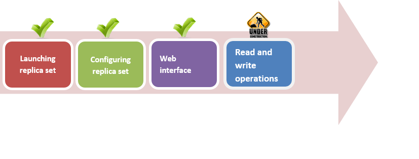

# Replica Set Deployment - Part 1

## AIM

The AIM of the following exercise

The steps involved will include:

1. Launching replica set
1.	Configuring replica set
2.	Mongo web interface
3.	Reatd and write operations

Estimated Completion Time: 40 minutes 

Launching and configuring replica set

**Step 1.**  Before launching a replica set, create folders to store member’s data:

a)	Navigate to the “C:\MongoDB\dbs” and create subdirectory ”rs_test”. 

b)	Then create three new subdirectories inside that, you just created:

Each folder will contain contain one of the members. 

c)	Three new ones will be found in your folder C:\MongoDB\dbs\rs_test:

**Step 2.**  Open three cmd windows and create three new instances of mongodb servercontemporaneously in these windows: 

mongod --port 27017 --replSet test --dbpath C:\MongoDB\test_rs\rs1 --rest
mongod --port 27018 --replSet test --dbpath C:\MongoDB\test_rs\rs2 --rest
mongod --port 27019 --replSet test --dbpath C:\MongoDB\test_rs\rs3 –rest

The commands above include the following properties:
•	portanddbpath – similar from previous chapters
•	replSet - unique name for replica set which is given to all members
•	rest - to enable rest interface for the admin web page

 put configuration image

**Step 3.** Now, let’s configure our replica set.

a)	Create new cmd window and connect to server rs1 using mongodb shell:

b)	Next, the replication set must be initialized. To initiate the replica set, create the config and carry out the following command:

 
You can enter the rs.status () in the shell prompt to check how many servers are in the replica set.

As you can see we have only one server added to replica set, which is primary now. 

c)	Let's add the rest of the servers to the replica set:

d)	And look at the status again:

 

We have one primary and two secondary members.

**Step 4.**  Replication web interface. As we have used –rest option at the launch of replica set members, mongodb provides web interface to our replica set.

The following URL should be entered to the browser address bar: 
http://<machine-name>:<port>/_replSet 

Our url seems like:
http://localhost:28017/_replSet
Port 28017 is used by default.

 

Picture 10.1.1Replication web interface

There is ability to view replica set config, get replica set status, see docs and other.

**Step 5.**  Read and write to replica set.

a)	Launch new console and connect to the secondary port (27018 or 27019)

The output string tells us that we are connected to secondary member.

 main image

b)	Switch to the console with primary member and save documents:

**Step 6.**  Now, let’s try to get these books from the secondary member.

a)	Firstly the following command should be executed:

By default, the reading from secondary members is prohibited. This is to protect you from performing eventually consistent reads by accident. The command above permits the reading 

b)	Find all books

Replica set work correctly.

