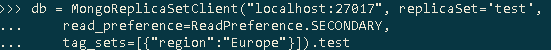
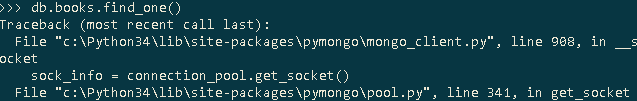

# Working with PyMongo - Part 2

## AIM

The AIM of the following exercise

The steps involved will include:

1. Connectig to the mongodb
2. Read and write operations
3. Read preferences
4. Replica set member tagging
5. Fault tolerance in motion

Estimated Completion Time: 30 minutes 

PyMongo makes working with replica sets easy.

**Step1.** To connect to the running replica set (from previous lab work)

a)	import pyMongo:

b)	There are few different ways to connect to the replica set:

 
As you can notice, the result is the same. So take you pick and save connection to variable:

**Step 2.** To ensure the correctness of connection:

a)	output book collection from the previous lab:

b)	And try to save some book:

 
c)	Open new mongo console, and verify that the new book was saved successfully.

 

**Step 3.** Instead of a simple MongoClient you can use MongoReplicaSetClient. It offers two key features: secondary reads and replica set health monitoring. 

a)	To connect using MongoReplicaSetClient just provide a host: port pair and the name of the replica set:

b)	You can change read preference. It means that you recommend pymongo some replica member to perform operations.

 

**Step 4.** One of the pymongo features is the selecting member according to tags.

a)	Switch to mongo and reconfigure the replica set

We added tags which describe the location of the member.

b)	Now, we may choose member with a region. Set read preference to “Secondary” and passthe appropriate tags:

c)	And test the connection:

**Step 5.** If something bad has occurred with primary member, pymongo automatically reconnects to the new primary member

a)	Reconnect to the replica set with the simple connection and check out connection port:

If the combination “<Ctrl>+<C>” is pressed in our mongod instance with primary member, the process ends. So that, switch to the console with primary member and press “<Ctrl>+<C>”.

b)	When we will try to read something, an exception will be thrown.

On subsequent attempts to run the query we might continue to see this exception. 

c)	Eventually, replica set will elect a new primary

The new primary member is running on the 27018 port.

