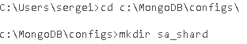
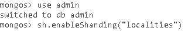
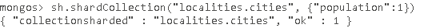

# Sharded cluster deployment

## AIM

The AIM of the following exercise

The steps involved will include:

1.	Working with sharding
2.	Working with mongos

Estimated Completion Time: 55 minutes 

**Step 1.** Deploy a test sharded cluster.
Sharded cluster deployment begins with creating config servers. The config servers contain the cluster’s metadata. The number of the may vary. The production deployment requires three instances, but we need only one instance for testing. 

a)	As with the simple mangos server, we need some directory to contain data files.

b)	Now, we have data storage for the config server. Start it by issuing the following command in the command line:

``
mongod --configsvr --dbpath c:\MongoDB\configs --port 27019
``

We can even not specify port, because 27019 port is used by default.

c)	After config server is running, we need to launch a few mangos instances, which will routing our queries. Carry out the following command separately in the two command lines:

``
mongos --configdb localhost:27019 --port 27017
mongos --configdb localhost:27019 --port 27018
``

**Step 2.** As the mongos instances are running, it’s time to think about shrads. The shard may be a replica set or a standalone mongod instance.First shard will be replica set.

a)	Create folders for the replica set member:

 
b)	Start three mongod instances on the port from 3000 to 3002

``
mongod --replSet rs_shard --port 30000 --dbpath c:\MongoDB\configs\rs_shard\rs1
mongod --replSet rs_shard --port 30001 --dbpath c:\MongoDB\configs\rs_shard\rs2
mongod --replSet rs_shard --port 30002 --dbpath c:\MongoDB\configs\rs_shard\rs3
``

c)	Connect to the one of the replica set members:

d)	All replica set members are running now, but before using we must initialize them.

 

  
 e)	Let’s ensure that replica set is working:
 

  

   
**Step 3.**  First shard was created successfully.

a)	Next shard will be standalone mongod instance:
A folder for data containing should be created:

 
b)	Start the new mongod instance:

Let’s summarize: we have running config server on the 27019 port, two mongos servers on the 27017 and 27018 ports respectively, three replica set members – 30000, 30001, 30002 ports, and standalone mongod server on the 40000 port.

**Step 4.**  Now, all parts are running and we must make it work.

a)	Firstly, run Mongo client connect to one of the mangos instances. 

``
mongo --host localhost --port 27017
``

Now, mongos knows nothing about running shards. We must add manually shards to the cluster:

b)	Add replica set “rs_shard” with member running on 3000 port. 

c)	Add standalone mongod server:

**Step 5.**  Mongos, also, know nothing which database and collection should be sharded. 

We will use database “localities” with collection “cities” where the population will be sharded key.
a)	Specify the database name:

b)	Then, let’s create the collection and fill it:

 

 
c)	As mentioned before, population field will be sharded index, so we need to create an index for this field.
 

   
d)	To start sharding, issue the following example:

e)	Mong

 
 oDB provides the an ability to add documents to the sharded collection as to simple collection:

 
f)	To see information about running cluster, carry out the following command:

 
As you can see, balancer splits chunks equally between two shards. The lowest lines show sharded key ranges to all chunks

**Task completed.**

 

**Step 1.**  Connecting to the sharded cluster

a)	Python interacts with the sharded as with the simple server. You don’t worry about shards or config servers. You only need to know mongos instance addresses (see previous lab).
 

b)	Try to output some city:

 
**Step 2.**  Replica set as a shard provides excellent fault tolerance.

a)	Try to stop one of the replica set members and get a city again:

 
Your application does not know about this problem.

**Step 3.**  But what if mongos instance is in downtime. We have two mongos processes, and pyMongo automatically switch to another, working instance.

a)	Let’s see, which port is using now aand turn off it.

 
b)	Try to read:

An exception was occurred.

c)	With the next attempt, everything, everything is going well:

 
d)	Check the connection:

We have been reconnected to the 27018 port.

**Step.4**  Sharded cluster, also, can be configured from source code. It enables you not run mongo client to configure sharding. You create a script which does it automatically.

Deploy simple sharding cluster with one config server, one mongos instance and two standalone shards.

a)	Create directory for our cluster and subdirectories for config server and shards data:

``
cd c:\MongoDB\
mkdir shard_dir
mkdir shard_dir\configs
mkdir shard_dir\shard1
mkdir shard_dir\shard2
``
b)	Launch config server:

``
mongod --configsvr--dbpath c:\MongoDB\shard_dir\configs --port27019
``

c)	And mongos connected to the server above:

``
mongos --configdb localhost:27019--port27018
``

d)	Then run two shards:

``
mongod --dbpath c:\MongoDB\shard_dir\shard1 --port27020
mongod --dbpath c:\MongoDB\shard_dir\shard2 --port27021
``

**Step.5.**  We need to initialize our sharded cluster

e)	Connect to mongos and add shards to the cluster:

``
mongo --port27018
sh.addShard('localhost:27020')
sh.addShard('localhost:27021')
``

Now all setup from mongo console is done. Database and collection sharding we will enable by python script.

f)	Run the following script in your pycharm ide.

**config.py**

``
from pymongo import MongoClient, errors 
def configure_shard_cluster():
``

``
client = MongoClient('localhost',27018)
try:
   client.admin.command('enableSharding','test')
except errors.PyMongoError:
print("Database already sharded")
  client.test.Addr_book.create_index('number')
``

``
try:
client.admin.command('shardCollection','test.Addr_book', key={'number': 1})
except errors.PyMongoError:
print("Collection already sharded")
print("Sharding configured successfully") 
configure_shard_cluster()
``

**Step 6.**  This script connects to the mongos on the 27018 port. Then enables sharding for the database and collection. Commands “enableSharding” and ‘sharCollection' throws exceptions if you run them twice. Try/catch constructions catch these exceptions. 

g)	Let’s check sharding status:

The configuration was successful.

**Step 7.**  Let’s create a new project and call it “Address book”. This project will keep contacts in the mongodb database.

There are three main features of this project: saving new contacts, removing old contacts and returning contacts to user.

The ‘AddressBook’ class is the core of application. Constructor takes next parameters: MongoDB client, database and collection names which will contain contacts. By default db name is ‘test’ and collection name is ‘Addr_book’

``
from pymongo import errors, MongoClient
class AddressBook(object):
#The constructor received three parameters: client connected to the mongo server,
#database and collection names to contain address book
def__init__(self, client, db_name ="test", collection_name ="Addr_book"):
self.address_book= client[db_name][collection_name]
``

self.address_book contains reference to the collection.

First Method inserts new contacts to address book:

``
#The purpose of the following method is adding new contacts to address book
def add_contact(self, new_contact):
try:
self.address_book.insert(new_contact)
print("Added new contacts")
except errors.PyMongoError:
#The PyMongoError is the basic pymongo exception.
#Application does not interrupted but only prints connecting error message
print("Connection or writing error")
``

**Step 8.**  The method above tries to insert new document to the collection, using ‘self.address_book’ reference. If an exception occurred, it prints an error message.

The next method removes unnecessary contacts:

``
def remove_contact(self, contact):
try:
   result =self.address_book.remove(contact)
#Result dict contains field 'n', with number of affected fields
#The get method is used because removing method may return None in some cases
print("Removed {} objects".format(result.get('n',0)))
except errors.PyMongoError:
print("Connection error")
``

The purpose of the method above is to remove documents coinciding with passed document. Method, also, result of removing.

Last method return document with contact information to user:

``
def get_contacts(self, contact_info ={}):
try:
print("Matched with these parameters {}:".format(contact_info))
for contact inself.address_book.find(contact_info):
print(contact)#Print each matched contact
except errors.PyMongoError:
print("Connection error")
``

Find method returns iterable cursor of the resulting collection, and we traverse it by loop cycle.

**Step 9.**  It remains only to test our project:

We will use our sharding, deployed in the previous lesson. As mentioned before, pymongo works with the sharded cluster as with simple mongod serve. So that, you need only know port of the mongos instance and nothing more.

Create new Address book object.

``
book = AddressBook(MongoClient('localhost',27018))
``

If you do not remember, mongos is running on the 27018 port.
Try to insert few contacts:

``
book.add_contact({"name":"Bob","age":42,"number":123456789})
book.add_contact({"name":"Alice","number":987654321})
book.add_contact({"name":"Eve","age":42,"number":111222333})
``

Result:

``
Added new contact
Added new contact
Added new contact
``
Get some of them

``
book.get_contacts({"name":"Bob"})
``

Result:

``
Matched with these parameters {'name': 'Bob'}:
{'name': 'Bob', 'age': 42, '_id': ObjectId('5411a51045c8d71584f0a387'), 'number': 123456789}
``

And remove contacts with age of 42:

``
book.remove_contact({"age":42})
``

Result:

``
Removed 2 objects
``

Look at the remaining objects:

``
book.get_contacts({})
``

Result:

``
Matched with these parameters {}:
{'name': 'Alice', '_id': ObjectId('5411a51045c8d71584f0a388'), 'number': 987654321}
``

In the next chapters we will improve our project and add new features.
Project and add new features.

Task completed.
